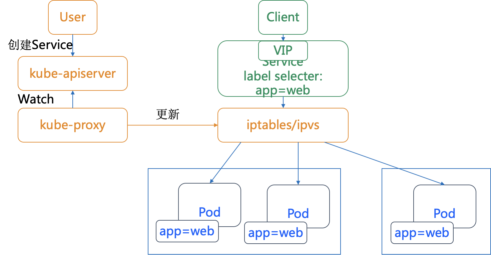

# Service

## Introduction

Service 的主要作用是作为 Pod 的代理入口，从而代替Pod对外暴露一个固定的网络地址。 K8s 之所以需要 Service，一方面是因为 Pod 的 IP 不是固定的，另一方面则是因为一组 Pod 实例之间总会有负载均衡的需求。

Service 是应用服务的抽象，通过 labels 为应用提供负载均衡和服务发现。被 Service 的 selector 选中的 Pod，就称为 Service 的 Endpoints，由 kube-proxy 负责将服务 IP 负载均衡到这些 endpoints 上，可以使用 kubectl get ep 命令看到它们。只有处于 Running 状态，且 readinessProbe 检查通过的 Pod，才会出现在 Service 的 Endpoints 列表里。并且，当某一个 Pod 出现问题时，k8s 会自动把它从 Service 里摘除掉。每个 Service 都会自动分配一个 cluster IP（仅在集群内部可访问的虚拟地址）和 DNS 名，其他容器可以通过该地址或 DNS 来访问服务，而不需要了解后端容器的运行。

### IP & Port

- IP
  - podIP: each pod's IP
  - clusterIP: each service's IP (on the clusterIP mode)
  - nodeIP: hosting server IP
- Port
  - containerPort: container's exposed port
  - targetPort: 容器/Pod用到的端口，`<pod-ip>:targetPort`
  - port: Service用到的端口，`<cluster-ip>:port`
  - nodePort: node用到的端口，`<node-ip>:nodePort`

### 实现原理

Service 是由 kube-proxy 组件，加上 iptables 来共同实现的。



kube-proxy 就可以通过 Service 的 Informer 感知到这样一个 Service 对象的添加。而作为对这个事件的响应，它就会在宿主机上创建这样一条 iptables 规则

```bash
-A KUBE-SERVICES -d 10.0.1.175/32 -p tcp -m comment --comment "default/hostnames: cluster IP" -m tcp --dport 80 -j KUBE-SVC-NWV5X2332I4OT4T3
```

这条 iptables 规则的含义是：凡是目的地址是 10.0.1.175（Service的VIP）、目的端口是 80 的 IP 包，都应该跳转到另外一条名叫 KUBE-SVC-NWV5X2332I4OT4T3的 iptables 链进行处理。

```bash
-A KUBE-SVC-NWV5X2332I4OT4T3 -m comment --comment "default/hostnames:" -m statistic --mode random --probability 0.33332999982 -j KUBE-SEP-WNBA2IHDGP2BOBGZ
-A KUBE-SVC-NWV5X2332I4OT4T3 -m comment --comment "default/hostnames:" -m statistic --mode random --probability 0.50000000000 -j KUBE-SEP-X3P2623AGDH6CDF3
-A KUBE-SVC-NWV5X2332I4OT4T3 -m comment --comment "default/hostnames:" -j KUBE-SEP-57KPRZ3JQVENLNBR
```

KUBE-SVC-NWV5X2332I4OT4T3 规则是3条规则的集合，这三条链指向的最终目的地，其实就是这个 Service 代理的三个 Pod。所以这一组规则，就是 Service 实现负载均衡的位置。

```bash
-A KUBE-SEP-57KPRZ3JQVENLNBR -s 10.244.3.6/32 -m comment --comment "default/hostnames:" -j MARK --set-xmark 0x00004000/0x00004000
-A KUBE-SEP-57KPRZ3JQVENLNBR -p tcp -m comment --comment "default/hostnames:" -m tcp -j DNAT --to-destination 10.244.3.6:9376

-A KUBE-SEP-WNBA2IHDGP2BOBGZ -s 10.244.1.7/32 -m comment --comment "default/hostnames:" -j MARK --set-xmark 0x00004000/0x00004000
-A KUBE-SEP-WNBA2IHDGP2BOBGZ -p tcp -m comment --comment "default/hostnames:" -m tcp -j DNAT --to-destination 10.244.1.7:9376

-A KUBE-SEP-X3P2623AGDH6CDF3 -s 10.244.2.3/32 -m comment --comment "default/hostnames:" -j MARK --set-xmark 0x00004000/0x00004000
-A KUBE-SEP-X3P2623AGDH6CDF3 -p tcp -m comment --comment "default/hostnames:" -m tcp -j DNAT --to-destination 10.244.2.3:9376
```

这三条链，其实是三条 DNAT 规则。而 DNAT 规则的作用，就是在 PREROUTING 检查点之前，也就是在路由之前，将流入 IP 包的目的地址和端口，改成–to-destination 所指定的新的目的地址和端口。可以看到，这个目的地址和端口，正是被代理 Pod 的 IP 地址和端口。这样，访问 Service VIP 的 IP 包经过上述 iptables 处理之后，就已经变成了访问具体某一个后端 Pod 的 IP 包了。这些 Endpoints 对应的 iptables 规则，正是 kube-proxy 通过监听 Pod 的变化事件，在宿主机上生成并维护的。

但 Service 的访问在 k8s 集群之外是无效的。所谓 Service 的访问入口，其实就是每台宿主机上由 kube-proxy 生成的 iptables 规则，以及 kube-dns 生成的 DNS 记录。而一旦离开了这个集群，这些信息对用户来说，也就自然没有作用了。

### IPVS

IPVS 模式的工作原理，其实跟 iptables 模式类似。当我们创建了前面的 Service 之后，kube-proxy 首先会在宿主机上创建一个虚拟网卡（叫作：kube-ipvs0），并为它分配 Service VIP 作为 IP 地址。而接下来，kube-proxy 就会通过 Linux 的 IPVS 模块，为Pod的3个 IP 地址设置三个 IPVS 虚拟主机，并设置这三个虚拟主机之间使用轮询模式 (rr) 来作为负载均衡策略。

一个集群是否ipvs，取决于它的配置方式。

## 类型

K8S集群Service类型有多种

- ClusterIP 分配一个集群内IP（默认）
- NodePort 绑定到一个Node的IP
- ExternalName 使用外部DNS
- LoadBalancer 使用外部负载均衡

### ClusterIP

K8S在这种服务下为Pod产生一个内部的一个虚拟 IP，是默认的服务方式。Only for the k8s cluster access。

### NodePort

NodePort为服务供集群外部调用。其将 Service 承载在 Node 的静态端口上，端口号和 Service 一一对应，那么集群外的用户就可以通过 `NodeIP:Port` 的方式调用到 Service（前提是该IP可以从公网访问）

如果你不显式地声明 nodePort 字段，ks8 就会为你分配随机的可用端口来设置代理。这个端口的范围默认是 30000-32767

对于 NodePort，kube-proxy 要做的就是在每台宿主机上生成这样一条 iptables 规则：

```bash
-A KUBE-POSTROUTING -m comment --comment "kubernetes service traffic requiring SNAT" -m mark --mark 0x4000/0x4000 -j MASQUERADE
```

### ExternalName

ExternalName Service 是一种特殊类型的 Service，主要用于访问位于集群外部的服务（例如跨Namespace的Pod间使用name互相访问）。 它的作用是返回集群外服务的域名/主机名。它没有 Selector，也没有定义任何Port 或是 Endpoints。

### LoadBalancer

在NodePort基础上，控制Cloud Provider创建LB来向节点引流

## 其他

除了上述几种类型，实践中还有一下几种操作方式

### externalIP

给Service直接分配公有IP。需要和外部路由配合确保确保访问这个IP的数据包能够从集群外路由到集群内的某个节点上。之后就是进入节点哪通讯的范畴了。

根据 Service 的规定，`externalIPs` 可以同任意的 ServiceType 来一起指定

### Headless Service

有时不需要或不想要负载均衡，以及单独的 Service IP。 遇到这种情况，可以通过指定 Cluster IP（spec.clusterIP）的值为 "None" 来创建 Headless Service。客户端通过查询集群的DNS（默认是10.96.0.10）确定Pod的IP，而不分配服务IP。

## CMD

- list service
  - `kubectl get services`: list services
  - `kubectl get services SVC_ID`: list a service
- describe services
  - `kubectl describe services`
  - `kubectl describe services SVC_ID`: describe a service
- create a service
  - `kubectl expose deployment DEP_ID --type NodePort --port 8080`: expose a deployment
    - `curl NODE_IP:NODE_PORT`: test
  - `kubectl apply -f svc1.yaml`: create a service from a YAML file
- delete a service
  - `kubectl delete service SVC_ID`
  - `kubectl delete service -l name=label`: delete a service by label
- list endpoints
  - `kubectl get endpoints`
  - `kubectl get endpoints SVR_ID`

## Lab

### NodePort

```shell
kubectl apply -f 10_service1-nodePort.yaml
kubectl get svc  -o wide # get the random node_port
curl 127.0.0.1:30888 # it works, even with Docker-for-Desktop
```

> `127.0.0.1`需要替换成集群的外部IP。如果是本地实验则是`127.0.0.1`

### ClusterIP

```shell
kubectl apply -f 15_service2-clusterIP.yaml
kubectl get svc  -o wide # get the clusterIP and port of the service
curl clusterIP:clusterPort # ping clusterIP doesnt' work, clusterIP should be bind with port (doesn't work with Docker-for-Desktop)
```

一般情况下，K8S使用iptables管理网络。这时候ping clusterIP是没有意义的。ClusterIP是一个虚拟的IP，存在于iptables的规则中。

> `clusterIP:clusterPort`需要进行替换
> 可能需要登陆到集群执行`curl clusterIP:clusterPort`
> 在使用IPVS的集群上，是可以ping clusterIP的。

### Expose CMD

```shell
kubectl apply -f 20_service3-pod-cmd.yaml
kubectl expose pod pod-service3 --type=NodePort --target-port=80 --port=8888 
curl 127.0.0.1:nodePort
```

> nodePort是不确定的。这是因为我们没有在expose命令中指定`--node-port`，因此K8S在node上随机选择了端口。需要使用`kubectl get svc -o wide` 查看其值

### Health Check

如果没有 health check，有些服务会报错

```shell
kubectl apply -f 30_service4-health-check.yaml
kubectl expose deployment service4-dep-health-check
kubectl get svc
curl clusterIP:8080 # doesn't work with Docker-for-Desktop
```

> `clusterIP`需要替换

> `kubectl get pods`可以查看Pods的状态

### External Service (tmp)

A service *without label-selector* is supposed to connect to an external service through a manually create endpoint.

```shell
kubectl apply -f 40_service5-endpoints.yaml
kubectl apply -f 41_endpoints.yaml
kubectl get endpoints # list
kubectl describe endpoints service5-endpoints # ep use the same name as svc
```

> 如果遇到"Invalid value: "127.0.0.1": may not be in the loopback range (127.0.0.0/8, ::1/128)"，则需要将`41_endpoints.yaml`修改为其他地址，例如某张网卡获得的IP。

### Headless Service

*Without clusterIP*, a service maps directly to pod endpoints. It uses only label selector to return backend endpoint list.  

```shell
kubectl apply -f 50_svc-headless.yaml
kubectl describe svc svc-headless
```

`50_svc-headless.yaml`解释如下

```yaml
apiVersion: v1
kind: Service
metadata:
  name: svc-headless
spec:
  selector: # 匹配 spec.template.metadata
    k8s-app: headless-nginx 
  ports:
  - port: 80 # 代理端口
  clusterIP: None # 不分配clusterIP

---

apiVersion: apps/v1
kind: Deployment
metadata:
  name: svc-headless
spec:
  replicas: 2
  selector:
    matchLabels: # 匹配 spec.template.metadata
      k8s-app: headless-nginx
  template:
    metadata:
      labels:
        k8s-app: headless-nginx # 匹配 spec.selector.matchLabels
    spec:
      containers: # 启动了一个ngixn容器
      - name: nginx
        image: nginx
        imagePullPolicy: IfNotPresent
        ports: 
        - containerPort: 80
        resources:
          limits:
            memory: "200Mi"
            cpu: "500m"
```

使用DNS工具查询`svc-headless.default.svc.cluster.local` 在K8S的DNS服务器（10.96.0.10）的解析结果

```shell
nslookup svc-headless.default.svc.cluster.local 10.96.0.10
```

> 可能需要`yum install nslookup` 或者 `apt-get install dnsutils` 安装该工具
