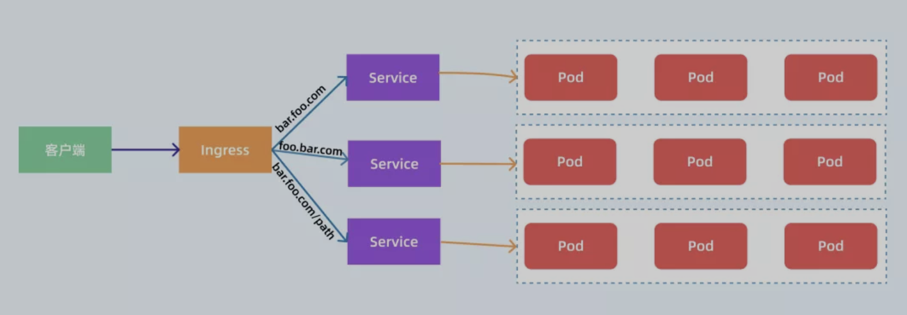

# Ingress

## 简介

通常情况下，service 和 pod 的 IP 仅可在 k8s 集群内部访问，k8s 集群外部的请求需要转发到 service 在 Node 上暴露的 NodePort 上，然后再由 kube-proxy 将其转发给相关的 Pod。而 Ingress 就是为进入 k8s 集群的请求提供路由规则的集合。Ingress 其实就是从 K8s 集群外部访问集群的一个入口，将外部的请求转发到集群内不同的 Service 上，其实就相当于 nginx、haproxy 等 LB，所以 ingress 其实是为了代理不同后端 Service 而设置的路由服务。Ingress 是 L7 的路由，而 Service 是 L4 的负载均衡，Ingress Controller 基于 Ingress 规则将 client 的 request 直接转发到 service 对应的后端 endpoint（即 pod）上，这样会跳过 kube-proxy 的转发功能。

Ingress Controller 可以理解为一个监听器，通过不断地监听 kube-apiserver，实时的感知后端 Service、Pod 的变化，当得到这些信息变化后，Ingress Controller 再结合 Ingress  的配置，更新反向代理负载均衡器，达到服务发现的作用。其实这点和服务发现工具 consul、 consul-template 非常类似。Ingres Controller 以 DaemonSet 的形式创建，在每个 node 上以 Pod hostPort 的方式启动一个 Nginx 服务。它保持 watch Apiserver 的 /ingress 接口以更新 Ingress 资源，以满足 Ingress 的请求。现在可以供大家使用的 Ingress Controller 有很多，比如 traefik、nginx-controller、Kubernetes Ingress Controller for Kong、HAProxy Ingress controller，当然你也可以自己实现一个  Ingress Controller，现在普遍用得较多的是 traefik 和 nginx-controller。



### Installation
```shell
helm install nginx-ingress-controller --namespace kube-system stable/nginx-ingress # ingress controller安装在localhost的80和443端口
kubectl --namespace kube-system get services -o wide -w nginx-ingress-controller-controller
```
### Another Installation

if the upper one doesn't work

Download "ingress-nginx.yaml" in https://github.com/yundd/kubernetes/tree/master/k8s_install/ingress, then 

```shell
kubectl apply -f ingress-nginx.yaml
```

- Check Installation
```shell
helm install svc1 ./svc1/chart
kubectl get ingress -o wide # check if the backend endpoints are bound
vim /etc/hosts # xxx.com 127.0.0.1
curl -H 'Host:svc1.xxx.com' 127.0.0.1:80 # check the ingress
```
- Troubleshooting
```shell
kubectl exec -it -n kube-system nginx-ingress-controller-controller-57f69dc9b9-qf6gw -- cat /etc/nginx/nginx.conf
kubectl exec -it -n kube-system nginx-ingress-controller-controller-57f69dc9b9-qf6gw -- tail /var/log/nginx/error.log
```

### Hello-world


## Ingress策略

一个 Ingress 对象可以有多个host，每个 host 里可以有多个 path 对应多个service。Ingress 策略定义的 path 需要与后端真实 Service 的 path 一致，否则将会转发到一个不存在的 path 上。

### Host

```yaml
apiVersion: extensions/v1beta1
kind: Ingress
metadata:
  name: test
spec:
  rules:
  - host: foo.bar.com
    http:
      paths:
      - backend:
          serviceName: s1
          servicePort: 80
  - host: bar.foo.com
    http:
      paths:
      - backend:
          serviceName: s2
          servicePort: 80
```

### Path

```yaml
apiVersion: extensions/v1beta1
kind: Ingress
metadata:
  name: test
spec:
  rules:
  - host: foo.bar.com
    http:
      paths:
      - path: /foo
        backend:
          serviceName: s1
          servicePort: 80
      - path: /bar
        backend:
          serviceName: s2
          servicePort: 80
```

## Lab

### HTTP-Ingress-HTTP
see [here](10_svc1/src/README.md) to create the svc1 docker image

```shell
kubectl apply -f 10_svc1/ingress.yaml # launch ingress, service and deployment
curl -H 'Host:svc1.xxx.com' http://127.0.0.1:80
kubectl delete -f 10_svc1/ingress.yaml
```

### HTTP-Ingress-HTTPS
see [here](12_svc2/src/README.md) to create the svc2 docker image

```shell
kubectl apply -f ./12_svc2/ingress.yaml # launch ingress, service and deployment
curl -H 'Host:svc2.xxx.com' http://127.0.0.1:80
kubectl delete -f ./12_svc2/ingress.yaml
```

### HTTPS-Ingress-HTTP

```shell
openssl req -x509 -nodes -days 365 -newkey rsa:2048 -keyout 14_svc3/ic.key -out 14_svc3/ic.crt -subj "/CN=*.xxx.com/O=xxx.com" # create crt and key
kubectl create secret tls secret-tls-svc3 --key 14_svc3/ic.key --cert 14_svc3/ic.crt # create k8s secret
kubectl apply -f ./14_svc3/ingress.yaml # launch ingress, service and deployment
curl -H "Host:svc3.xxx.com" https://127.0.0.1 -k # curl in secure mode
curl --cert 14_svc3/ic.crt -H "host:svc3.xxx.com" https://127.0.0.1 # doesn't work since the signer isn't authorized
kubectl delete -f ./14_svc3/ingress.yaml
kubectl delete secret secret-tls-svc3
```


### HTTPS-Ingress-HTTPS (ssl-termination)

```shell
openssl req -x509 -nodes -days 365 -newkey rsa:2048 -keyout 16_svc4/ic.key -out 16_svc4/ic.crt -subj "/CN=*.xxx.com/O=xxx.com" # create crt and key
kubectl create secret tls secret-tls-svc4 --key 16_svc4/ic.key --cert 16_svc4/ic.crt # create secret
kubectl apply -f ./16_svc4/ingress.yaml # launch ingress, service and deployment
curl -H 'Host:svc4.xxx.com' https://127.0.0.1 -k
kubectl delete -f ./16_svc4/ingress.yaml
kubectl delete secret secret-tls-svc4
```

### HTTPS-Ingress-HTTPS (ssl-passthrough)(tmp)

```shell
openssl req -x509 -nodes -days 365 -newkey rsa:2048 -keyout svc5/ic.key -out svc5/ic.crt -subj "/CN=*.xxx.com/O=xxx.com" # create crt and key
kubectl create secret tls secret-tls-svc5 --key 18_svc5/ic.key --cert 18_svc5/ic.crt # create secret
kubectl apply -f ./18_svc5/ingress.yaml # launch ingress, service and deployment
- `--enable-ssl-passthrough` # add this flag to enable ssl passthrough in the ingress yaml file
curl -H 'Host:svc5.xxx.com' https://127.0.0.1 -k
kubectl delete -f ./18_svc5/ingress.yaml
kubectl delete secret secret-tls-svc5
```

## Debug
You may face some problems when using "helm repo add", then  you can try changing the source https://blog.csdn.net/u014089832/article/details/108593291

## Ref

1. [真一文搞定 ingress-nginx 的使用](https://mp.weixin.qq.com/s/wkdd3yDdZn6uk6VHXHYBZQ)
2. [实践kubernetes ingress controller的四个例子](https://tonybai.com/2018/06/21/kubernetes-ingress-controller-practice-using-four-examples/)
3. [HTTPS服务的Kubernetes ingress配置实践](https://tonybai.com/2018/06/25/the-kubernetes-ingress-practice-for-https-service/)

