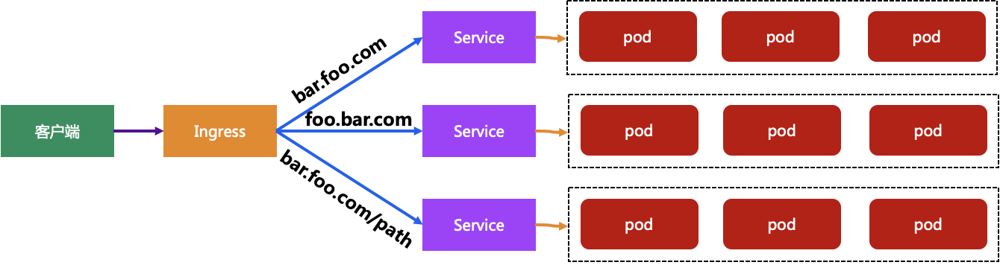

# Ingress

## 简介

通常情况下，service 和 pod 的 IP 仅可在 k8s 集群内部访问，k8s 集群外部的请求需要转发到 service 在 Node 上暴露的 NodePort 上，然后再由 kube-proxy 将其转发给相关的 Pod。而 Ingress 就是为进入 k8s 集群的请求提供路由规则的集合。Ingress 其实就是从 K8s 集群外部访问集群的一个入口，将外部的请求转发到集群内不同的 Service 上，其实就相当于 nginx、haproxy 等 LB，所以 ingress 其实是为了代理不同后端 Service 而设置的路由服务。Ingress 是 L7 的路由，而 Service 是 L4 的负载均衡，Ingress Controller 基于 Ingress 规则将 client 的 request 直接转发到 service 对应的后端 endpoint（即 pod）上，这样会跳过 kube-proxy 的转发功能。

Ingress Controller 可以理解为一个监听器，通过不断地监听 kube-apiserver，实时的感知后端 Service、Pod 的变化，当得到这些信息变化后，Ingress Controller 再结合 Ingress  的配置，更新反向代理负载均衡器，达到服务发现的作用。其实这点和服务发现工具 consul、 consul-template 非常类似。Ingres Controller 以 DaemonSet 的形式创建，在每个 node 上以 Pod hostPort 的方式启动一个 Nginx 服务。它保持 watch Apiserver 的 /ingress 接口以更新 Ingress 资源，以满足 Ingress 的请求。现在可以供大家使用的 Ingress Controller 有很多，比如 traefik、nginx-controller、Kubernetes Ingress Controller for Kong、HAProxy Ingress controller，当然你也可以自己实现一个  Ingress Controller，现在普遍用得较多的是 traefik 和 nginx-controller。



### Installation

```shell
helm repo add stable https://mirror.azure.cn/kubernetes/charts/
helm install nginx-ingress-controller --namespace kube-system stable/nginx-ingress # ingress controller安装在localhost的80和443端口
kubectl --namespace kube-system get services -o wide -w nginx-ingress-controller-controller
```

> 可以通过[Helm-Install](https://helm.sh/zh/docs/intro/install/)获取安装Helm的方法。

### Another Installation

if the upper one doesn't work

Download "ingress-nginx.yaml" in [https://github.com/yundd/kubernetes/tree/master/k8s_install/ingress](https://github.com/yundd/kubernetes/tree/master/k8s_install/ingress), then

```shell
kubectl apply -f ingress-nginx.yaml
```

> 注意替换无法下载的镜像

### Installation (adapted to GFW)

通过Helm安装，但不完全通过Helm安装

Helm安装K8S应用有如下阶段

1. 向Helm添加Repo。一个Repo就像是一个静态的站点
2. Helm从Report下载Charts（tgz格式）
3. Helm解压Charts，根据Charts部署APP

由于网络原因，我们显然需要对这个过程加以改动:

1. 使用代理下载Charts
2. 修改Charts中引用的镜像，替换成可以下载的

执行以下命令

```shell
helm repo add ingress-nginx https://kubernetes.github.io/ingress-nginx # 添加Repo
helm repo update # 可能需要代理
helm fetch ingress-nginx/ingress-nginx # 可能需要代理
tar -xvf ingress-nginx-x.xx.x.tgz
```

> `x.xx.x`为下载的ingress-nginx版本

将会把ingress-nginx的Charts解压到当前目录的ingress-nginx子目录下。我们需要修改其中的`values.yaml`以适应我们的集群。一般来说，我们自己搭建的集群有如下特点：

1. 没有外部的LB设施
2. 没有安装内部的LB设施（例如MetalLB）
3. 存在多个出口节点
4. `k8s.gcr.io/ingress-nginx/kube-webhook-certgen`和`k8s.gcr.io/ingress-nginx/controller`镜像可能会无法下载，因此需要替换

> 如果你使用的是其他集群（例如云平台的集群服务），则该教程可能不适用

修改values.yaml如下

```yaml
# values-prod.yaml
controller:
  name: controller
  image:
    registry: registry.hub.docker.com
    image: davidliyutong/ingress-nginx-controller # 镜像替换
    digest: # 需要把digest清零或者修改成正确的值

  dnsPolicy: ClusterFirstWithHostNet # 使用K8S的DNS
  
  extraArgs: # SSL-Passthrough 实验中需要的功能
    enable-ssl-passthrough:

  hostNetwork: true # 使用宿主网络，这将会占用所有出口的80/443端口

  publishService:  
  # hostNetwork 模式下设置为false，通过节点IP地址上报ingress status数据，不创建服务
    enabled: false

  kind: DaemonSet

  nodeSelector: 
    role: lb # 如果添加该选项，则只有存在role=lb的节点上才会有Pod

  service:  # HostNetwork 模式不需要创建service
    enabled: false
  
  admissionWebhooks:
    patch:
      enabled: true
      image:
        registry: registry.hub.docker.com
        image: davidliyutong/ingress-nginx-kube-webhook-certgen # 镜像替换
        digest: 
        
defaultBackend: # 路由没有命中时候的404页面提供方
  enabled: true
  name: defaultbackend
  image:
    registry: registry.hub.docker.com
    image: davidliyutong/ingress-nginx-defaultbackend-amd64  # 镜像替换
    digest: 
```

我们需要创建一个ingress-nginx的命名空间，然后在该命名空间内安装`ingress-nginx`。这样的好处是卸载的时候只需要删除该命名空间，就可以删除所有的安装。

```shell
kubectl create ns ingress-nginx
```

最后，手动安装ingrex-nginx

```shell
helm install --namespace ingress-nginx ingress-nginx ./ingress-nginx \
             -f ./ingress-nginx/values.yaml
```

所有Controller都READY标志着部署成功

```shell
$ kubectl get pods -n ingress-nginx -o wide
NAME                                            READY   STATUS    RESTARTS   AGE   IP               NODE    NOMINATED NODE   READINESS GATES
ingress-nginx-controller-sht2v                  1/1     Running   0          22m   10.64.13.11      node1   <none>           <none>
ingress-nginx-controller-wjb5j                  1/1     Running   0          22m   10.64.13.12      node2   <none>           <none>
ingress-nginx-defaultbackend-8657d58dfc-hvx7s   1/1     Running   0          22m   10.233.166.150   node1   <none>           <none>
```

> `helm uninstall ingress-nginx` 可以反安装
> `kubectl delete namespace ingress-nginx` 也可以，这是因为所有的ingress-nginx组件都安装在`ingress-nginx`命名空间下

### Installation on Minikube

```shell
minikube addons enable ingress
```

检查安装的状态

```shell
kubectl get pods -n ingress-nginx
```

### Troubleshooting

```shell
kubectl exec -it -n kube-system nginx-ingress-controller-controller-57f69dc9b9-qf6gw -- cat /etc/nginx/nginx.conf
kubectl exec -it -n kube-system nginx-ingress-controller-controller-57f69dc9b9-qf6gw -- tail /var/log/nginx/error.log
```

### Hello-world

## Ingress策略

一个 Ingress 对象可以有多个host，每个 host 里可以有多个 path 对应多个service。Ingress 策略定义的 path 需要与后端真实 Service 的 path 一致，否则将会转发到一个不存在的 path 上。

### Host

```yaml
apiVersion: extensions/v1beta1
kind: Ingress
metadata:
  name: test
spec:
  rules:
  - host: foo.bar.com
    http:
      paths:
      - backend:
          serviceName: s1
          servicePort: 80
  - host: bar.foo.com
    http:
      paths:
      - backend:
          serviceName: s2
          servicePort: 80
```

### Path

```yaml
apiVersion: extensions/v1beta1
kind: Ingress
metadata:
  name: test
spec:
  rules:
  - host: foo.bar.com
    http:
      paths:
      - path: /foo
        backend:
          serviceName: s1
          servicePort: 80
      - path: /bar
        backend:
          serviceName: s2
          servicePort: 80
```

## Lab

> 这一部分的许多镜像都需要自己编译，因此配置文件也要做相应的修改以便使用自己编译的镜像

### HTTP-Ingress-HTTP

see [here](10_svc1/src/README.md) to create the svc1 docker image

```shell
kubectl apply -f 10_svc1/ingress.yaml # launch ingress, service and deployment
curl -H 'Host:svc1.xxx.com' http://127.0.0.1:80
kubectl delete -f 10_svc1/ingress.yaml
```

> `http://127.0.0.1` 需要替换成集群Ingress节点的URL

### HTTP-Ingress-HTTPS

see [here](12_svc2/src/README.md) to create the svc2 docker image

```shell
kubectl apply -f ./12_svc2/ingress.yaml # launch ingress, service and deployment
curl -H 'Host:svc2.xxx.com' http://127.0.0.1:80
kubectl delete -f ./12_svc2/ingress.yaml
```

### HTTPS-Ingress-HTTP

```shell
openssl req -x509 -nodes -days 365 -newkey rsa:2048 -keyout 14_svc3/ic.key -out 14_svc3/ic.crt -subj "/CN=*.xxx.com/O=xxx.com" # create crt and key
kubectl create secret tls secret-tls-svc3 --key 14_svc3/ic.key --cert 14_svc3/ic.crt # create k8s secret
kubectl apply -f ./14_svc3/ingress.yaml # launch ingress, service and deployment
curl -H "Host:svc3.xxx.com" https://127.0.0.1 -k # curl in secure mode
cat 14_svc3/ic.key >> 14_svc3/ic.crt
curl --cert 14_svc3/ic.crt -H "host:svc3.xxx.com" https://127.0.0.1 # doesn't work since the signer isn't authorized
kubectl delete -f ./14_svc3/ingress.yaml
kubectl delete secret secret-tls-svc3
```

### HTTPS-Ingress-HTTPS (ssl-termination)

```shell
openssl req -x509 -nodes -days 365 -newkey rsa:2048 -keyout 16_svc4/ic.key -out 16_svc4/ic.crt -subj "/CN=*.xxx.com/O=xxx.com" # create crt and key
kubectl create secret tls secret-tls-svc4 --key 16_svc4/ic.key --cert 16_svc4/ic.crt # create secret
kubectl apply -f ./16_svc4/ingress.yaml # launch ingress, service and deployment
curl -H 'Host:svc4.xxx.com' https://127.0.0.1 -k
kubectl delete -f ./16_svc4/ingress.yaml
kubectl delete secret secret-tls-svc4
```

### HTTPS-Ingress-HTTPS (ssl-passthrough)(tmp)

```shell
openssl req -x509 -nodes -days 365 -newkey rsa:2048 -keyout 18_svc5/ic.key -out 18_svc5/ic.crt -subj "/CN=*.xxx.com/O=xxx.com" # create crt and key
kubectl create secret tls secret-tls-svc5 --key 18_svc5/ic.key --cert 18_svc5/ic.crt # create secret
kubectl apply -f ./18_svc5/ingress.yaml # launch ingress, service and deployment
- `--enable-ssl-passthrough` # add this flag to enable ssl passthrough in the ingress yaml file
curl -H 'Host:svc5.xxx.com' https://127.0.0.1 -k
kubectl delete -f ./18_svc5/ingress.yaml
kubectl delete secret secret-tls-svc5
```

## Debug

You may face some problems when using "helm repo add", then  you can try changing the source [helm 修改repo源](https://blog.csdn.net/u014089832/article/details/108593291)

```shell
helm repo remove stable
helm repo add stable https://kubernetes.oss-cn-hangzhou.aliyuncs.com/charts
helm repo update
helm search
```

> [https://kubernetes.oss-cn-hangzhou.aliyuncs.com/charts](https://kubernetes.oss-cn-hangzhou.aliyuncs.com/charts) 很久没有更新了。[https://charts.helm.sh/stable](https://charts.helm.sh/stable)是个不错的选择

## Tips

- `bootstrap_keys.sh`可以一键生成实验用的密钥，需要在30_ingress目录下执行
- `build_images.sh`可以一键编译实验用的镜像，并且上传到dockerhub。需要在30_ingress目录下执行。脚本会要求输入docker用户名和密码（并不会记录）。因此使用前需要创建dockerhub token。

## Ref

1. [真一文搞定 ingress-nginx 的使用](https://mp.weixin.qq.com/s/wkdd3yDdZn6uk6VHXHYBZQ)
2. [实践kubernetes ingress controller的四个例子](https://tonybai.com/2018/06/21/kubernetes-ingress-controller-practice-using-four-examples/)
3. [HTTPS服务的Kubernetes ingress配置实践](https://tonybai.com/2018/06/25/the-kubernetes-ingress-practice-for-https-service/)
