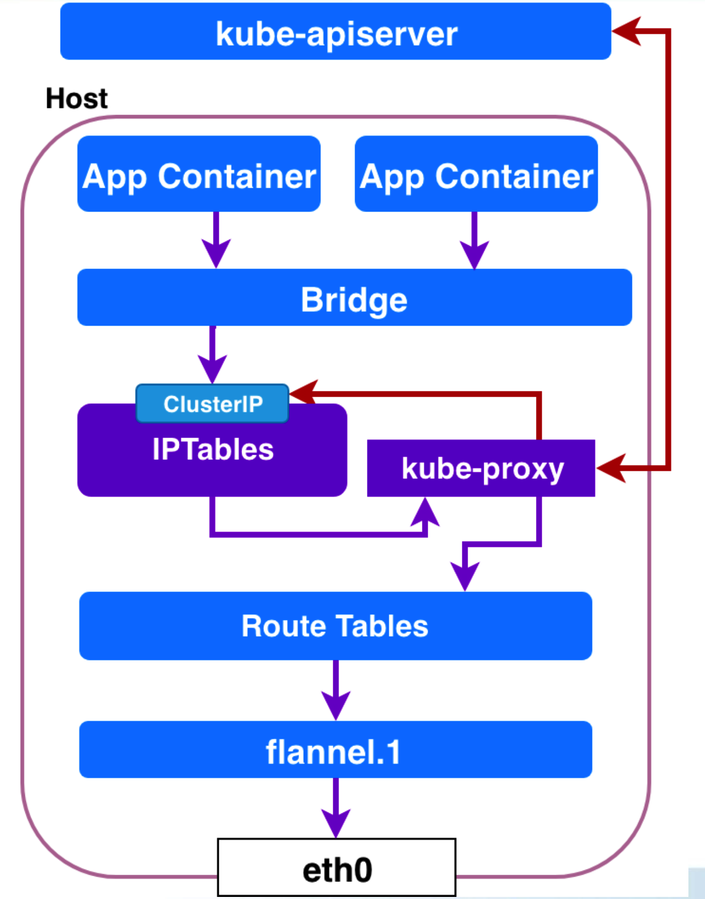
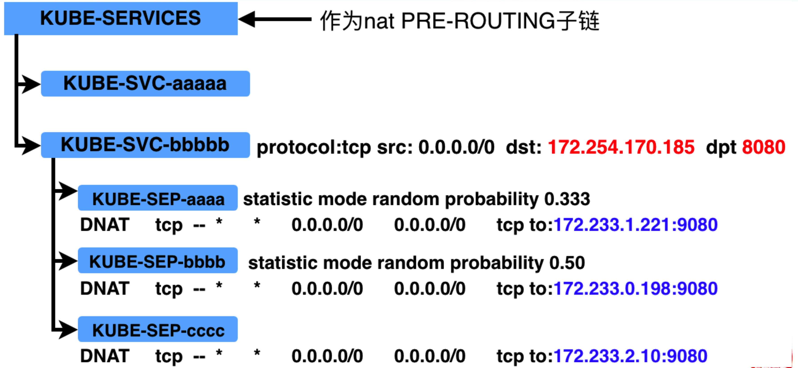
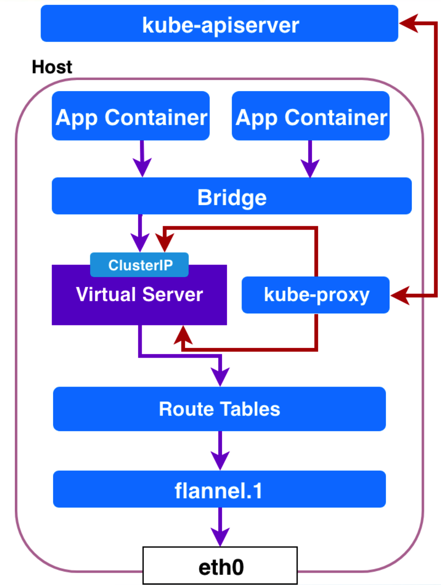

# kube-proxy

Service的clusterIP和nodePort等概念，都是kube-proxy通过Iptables的NAT转换实现的。
kube-proxy在运行过程中动态创建与service相关的Iptables规则，这些规则实现了clusterIP和NodePort的request流量重定向到service对应的SocketServer。

## Functionality

- 通过监听kube-apiserver获得service、endpoint变化
- 为每个service在本地node上建立一个SocketServer、监听一个临时端口：确保本host上的任何pod能访问该service
- service的本地SocketServer会通过内部LB均匀发送到后端某个pod的端口上
- LB保存了endpoint列表（该service对应的podIP+port）：确保了service的request会被寄到任何一个node的pod上

## Iptables

kube-proxy会为每个service在本地创建4条规则：

- CT中通过clusterIP+port访问service
- Host中通过clusterIP+port访问service
- CT中通过nodeIP+nodePort访问service
- Host中通过nodeIP+nodePort访问service

## Service实现机制

### Userspace

发往clusterIP的流量会先转发给kube-proxy，然后由kube-proxy转发给不同的pod。

### IPtables

kube-proxy直接在iptables里面创建转发规则，把发给clusterIP的流量转发给不同的pod。

iptables中的转发规则如下：

### IPVS

kube-proxy创建IPVS，由IPVS把转发给clusterIP的流量转发给相应的pod。

