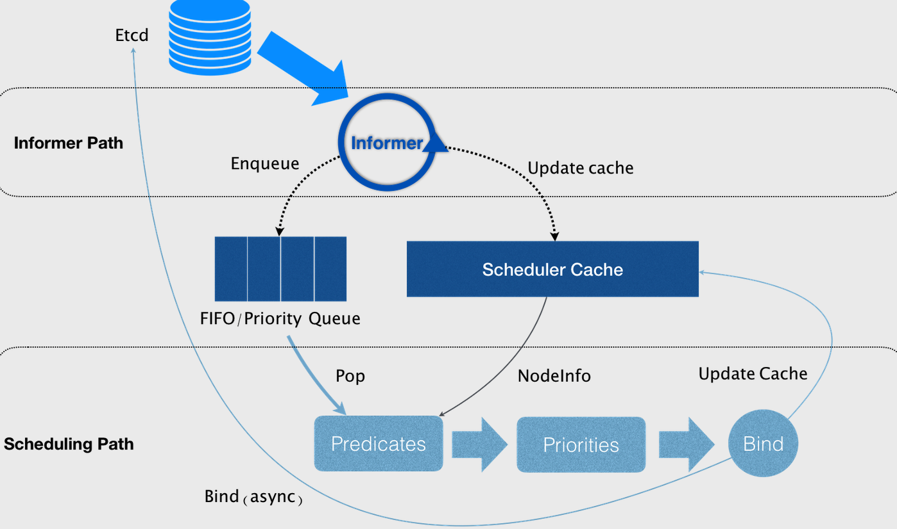

# kube-scheduler
kube-scheduler的作用是根据待调度pod列表、可用node列表、以及调度算法/策略，将待调度pod绑定到某个合适的node上（将pod的spec.nodeName字段填上调度结果的节点名字），并将绑定信息写入etcd。

## 调度原理

- 第一个控制循环是Informer Path，用于监听（Watch）Etcd 中 Pod、Node、Service 等与调度相关的 API 对象的变化。比如，当一个待调度 Pod（即：它的 nodeName 字段是空的）被创建出来之后，调度器就会通过 Pod Informer 的 Handler，将这个待调度 Pod 添加进调度队列。同时，k8s默认调度器还要负责对调度对象进行缓存。
- 第二个控制循环是调度器负责 Pod 调度的主循环，我们可以称之为 Scheduling Path，它不断地从调度队列里出队一个 Pod。然后，调用 Predicates 算法进行node“过滤”（Predicates 算法需要的 Node 信息，都是从 Scheduler Cache 里直接拿到的）。再调用 Priorities 算法为上述列表里的 Node 打分，得分最高的 Node就会作为这次调度的结果。调度算法执行完成后，调度器就需要将 Pod 对象的 nodeName 字段的值，修改为上述 Node 的名字，这个步骤在k8s里面被称作 Bind。



## Predicates

Predicates 在调度过程中的作用，可以理解为 Filter，即：它按照调度策略，从当前集群的所有节点中，“过滤”出一系列符合条件的节点。这些节点，都是可以运行待调度 Pod 的宿主机。

当开始调度一个 Pod 时，scheduler会同时启动 16 个 Goroutine，来并发地为集群里的所有 Node 计算 Predicates，最后返回可以运行这个 Pod 的宿主机列表。每个 Node 执行 Predicates 会按照固定的顺序来进行执行不同的调度策略，其中的策略包括：GeneralPredicates、与 Volume 相关的过滤规则、宿主机相关的过滤规则、Pod 相关的过滤规则。

- **NoDiskConflict**：检查在此主机上是否存在卷冲突。如果这个主机已经挂载了卷，其它使用这个卷的Pod不能调度到这个主机上。GCE 、Amazon EBS 和 Ceph RBD 使用的规则如下: 
  1. GCE 允许同时挂载多个卷，只要这些卷都是只读的。
  2. Amazon EBS 不允许不同的 Pod 挂载同一个卷。
  3. Ceph RBD 不允许任何两个 pods 分享相同的 monitor，match pool 和 image。
- **NoVolumeZoneConflict :**  检查在给定的 zone 限制前提下，检查在此主机上部署 Pod 是否存在卷冲突，目前指对 PV 资源进行检查(NewVolumeZonePredicate对象predicate函数)。
- **MaxEBSVolumeCount :**  确保已挂载的 EBS 存储卷不超过设置的最大值。默认值是39。它会检查直接使用的存储卷，和间接使用这种类型存储的 PVC 。计算不同卷的总目，如果新的 Pod 部署上去后卷的数目会超过设置的最大值，那么 Pod 就不能调度到这个主机上。
- **MaxGCEPDVolumeCount :**  确保已挂载的 GCE 存储卷不超过设置的最大值。默认值是16。规则同MaxEBSVolumeCount。
- **MaxAzureDiskVolumeCount :**  确保已挂载的Azure存储卷不超过设置的最大值。默认值是16。规则同MaxEBSVolumeCount。
- **CheckNodeMemoryPressure :**  判断节点是否已经进入到内存压力状态，如果是则只允许调度内存为0标记的 Pod。
- **CheckNodeDiskPressure :**  判断节点是否已经进入到磁盘压力状态，如果是则不调度新的Pod。
- **PodToleratesNodeTaints :**  Pod 是否满足节点容忍的一些条件。
- **MatchInterPodAffinity :**  节点亲和性筛选。
- **GeneralPredicates :**  包含一些基本的筛选规则（PodFitsResources、PodFitsHostPorts、HostName、MatchNodeSelector）。
- **PodFitsResources :** 检查节点上的空闲资源(CPU、Memory、GPU资源)是否满足 Pod 的需求。
- **PodFitsHostPorts :** 检查 Pod 内每一个容器所需的 HostPort 是否已被其它容器占用。如果有所需的HostPort不满足要求，那么 Pod 不能调度到这个主机上。
- 检查主机名称是不是 Pod 指定的 HostName。
- 检查主机的标签是否满足 Pod 的 **nodeSelector**属性需求。

## Preemption

Preemption就是当一个高优先级的 Pod 调度失败后，该 Pod 并不会被“搁置”，而是会“挤走”某个 Node 上的一些低优先级的 Pod ，从而保证这个高优先级 Pod 的调度成功。

## Priorities

Priorities 阶段的工作就是为这些节点打分，每一个优先级函数会返回一个0-10的分数，分数越高表示主机越“好”，同时每一个函数也会对应一个表示权重的值。最终主机的得分用以下公式计算得出：

```math
finalScoreNode = (weight1 * priorityFunc1) + (weight2 * priorityFunc2) + … + (weightn * priorityFuncn)。
```

得分最高的节点就是最后被 Pod 绑定的最佳节点。其中打分规则包含：LeastRequestedPriority、BalancedResourceAllocation、NodeAffinityPriority、TaintTolerationPriority 和 InterPodAffinityPriority。

可以通过为 kube-scheduler 指定一个配置文件或者创建一个 ConfigMap ，来配置哪些规则需要开启、哪些规则需要关闭。并且，通过为 Priorities 设置权重来控制调度器的调度行为。

- **SelectorSpreadPriority :** 对于属于同一个  service、replication controller 的 Pod，尽量分散在不同的主机上。如果指定了区域，则会尽量把 Pod  分散在不同区域的不同主机上。调度一个 Pod 的时候，先查找 Pod 对于的 service或者 replication  controller，然后查找 service 或 replication controller 中已存在的 Pod，主机上运行的已存在的  Pod 越少，主机的打分越高。
- **LeastRequestedPriority :** 如果新的 pod  要分配一个节点，这个节点的优先级就由节点空闲的那部分与总容量的比值(（总容量-节点上pod的容量总和-新pod的容量）/总容量）来决定。CPU 和 memory 权重相当，比值最大的节点的得分最高。需要注意的是，这个优先级函数起到了按照资源消耗来跨节点分配 pods 的作用。计算公式如下：
  cpu((capacity – sum(requested)) * 10 / capacity) + memory((capacity – sum(requested)) * 10 / capacity) / 2
- **BalancedResourceAllocation :** 尽量选择在部署 Pod  后各项资源更均衡的机器。BalancedResourceAllocation不能单独使用，而且必须和  LeastRequestedPriority 同时使用，它分别计算主机上的 cpu 和 memory 的比重，主机的分值由 cpu 比重和  memory 比重的“距离”决定。计算公式如下：score = 10 – abs(cpuFraction-memoryFraction)*10
- **NodeAffinityPriority :** k8s 调度中的亲和性机制。Node Selectors（调度时将 pod 限定在指定节点上），支持多种操作符（In、 NotIn、 Exists、DoesNotExist、  Gt、 Lt），而不限于对节点 labels 的精确匹配。另外，Kubernetes 支持两种类型的选择器，一种是 “hard（requiredDuringSchedulingIgnoredDuringExecution）”选择器，它保证所选的主机满足所有Pod对主机的规则要求。这种选择器更像是之前的 nodeselector，在 nodeselector  的基础上增加了更合适的表现语法。另一种 “soft（preferresDuringSchedulingIgnoredDuringExecution）”  选择器，它作为对调度器的提示，调度器会尽量但不保证满足 NodeSelector 的所有要求。
- **InterPodAffinityPriority :** 通过迭代 weightedPodAffinityTerm 的元素计算和，并且如果对该节点满足相应的PodAffinityTerm，则将 “weight” 加到和中，具有最高和的节点是最优选的。
- **NodePreferAvoidPodsPriority(权重1W) :** 如果 Node 的  Anotation 没有设置 key-value:scheduler. alpha.kubernetes.io/ preferAvoidPods = "..."，则该 node 对该 policy  的得分就是10分，加上权重10000，那么该node对该policy的得分至少10W分。如果Node的Anotation设置了，scheduler.alpha.kubernetes.io/preferAvoidPods = "..." ，如果该 pod 对应的 Controller 是 ReplicationController 或 ReplicaSet，则该 node 对该 policy 的得分就是0分。
- **TaintTolerationPriority :** 使用 Pod 中 tolerationList 与 Node 节点 Taint 进行匹配，配对成功的项越多，则得分越低。

**另外在优选的调度规则中，有几个未被默认使用的规则：**

- **ImageLocalityPriority :** 据主机上是否已具备 Pod  运行的环境来打分。ImageLocalityPriority 会判断主机上是否已存在 Pod  运行所需的镜像，根据已有镜像的大小返回一个0-10的打分。如果主机上不存在 Pod  所需的镜像，返回0；如果主机上存在部分所需镜像，则根据这些镜像的大小来决定分值，镜像越大，打分就越高。
- **EqualPriority :** EqualPriority 是一个优先级函数，它给予所有节点一个相等的权重。
- **ServiceSpreadingPriority :** 作用与 SelectorSpreadPriority 相同，已经被 SelectorSpreadPriority 替换。
- **MostRequestedPriority :** 在  ClusterAutoscalerProvider 中，替换  LeastRequestedPriority，给使用多资源的节点，更高的优先级。计算公式为：(cpu(10 * sum(requested) / capacity) + memory(10 * sum(requested) / capacity)) / 2

