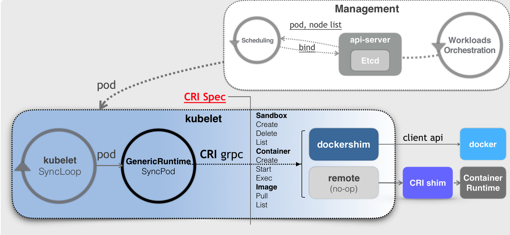

# kubelet

kubelet是k8s这样一个容器编排与管理系统跟容器打交道的主要“场所”。

处理master下发给本节点（node）的任务，管理本节点pod及其中的container。

- 在`API Server`上注册本node信息
- 通过`API Server`监听所有针对pod的操作，并做相关如创建、删除CT等的操作
- 通过cAdvisor监控container和node资源，并定期向master汇报资源使用情况

## 工作原理

kubelet就是一个控制循环SyncLoop，而驱动该控制循环运行的事件包括：Pod 更新事件；Pod 生命周期变化；kubelet 本身设置的执行周期；定时的清理事件。kubelet 启动的时候，先要设置 Listers，也就是注册它所关心的各种事件的 Informer。这些 Informer，就是 SyncLoop 需要处理的数据的来源。

kubelet 还负责维护着很多子控制循环，如Volume Manager、Image Manager、Node Status Manager 等。这些控制循环就是通过控制器模式，完成 kubelet 的某项具体职责。比如 Node Status Manager，就负责响应 Node 的状态变化，然后将 Node 的状态收集起来，并通过 Heartbeat 的方式上报给 APIServer。

kubelet通过Watch机制监听与自己相关的Pod对象的变化，并把这些 Pod 的信息缓存在自己的内存里。而当一个 Pod 完成调度、与一个 Node 绑定起来之后， 这个 Pod 的变化就会触发 kubelet 在控制循环里注册的 Handler HandlePods。此时，通过检查该 Pod 在 kubelet 内存里的状态，kubelet 就能够判断出这是一个新调度过来的 Pod，从而触发 Handler 里 ADD 事件对应的处理逻辑。在具体的处理过程当中，kubelet 会启动一个名叫 Pod Update Worker 的、单独的 Goroutine 来完成对 Pod 的处理工作。比如，如果是 ADD 事件的话，kubelet 就会为这个新的 Pod 生成对应的 Pod Status，检查 Pod 所声明使用的 Volume 是不是已经准备好。然后，调用下层的容器运行时（比如 Docker），开始创建这个 Pod 所定义的容器。kubelet 调用下层容器运行时的执行过程，并不会直接调用 Docker 的 API，而是通过一组叫作 CRI的 gRPC 接口来间接执行的。

SyncLoop设计的理念是要求这个控制循环是绝对不可以被阻塞的。凡是在 kubelet 里有可能会耗费大量时间的操作，比如准备 Pod 的 Volume、拉取镜像等，SyncLoop 都会开启单独的 Goroutine（小循环）来进行操作。

## CRI

之所以要在kubelet中引入CRI这样一层单独的抽象，当然是为了对k8s屏蔽下层容器运行时的差异。当kubelet要操作容器运行时时，会调用一个叫作 GenericRuntime 的通用组件来发起例如创建 Pod 的 CRI 请求。这个 CRI 请求会由dockershim响应，它把 CRI 请求里的内容拿出来，然后组装成 Docker API 请求发给 Docker Daemon。每台宿主机上安装的、负责响应 CRI 的组件被称作 CRI shim，它扮演着kubelet与容器项目之间的“垫片”（shim）的作用。它的作用就是实现CRI规定的每个接口，然后把具体的CRI请求“翻译”成对后端容器项目的请求或者操作。

CRI可分为两组：

- 第一组是 RuntimeService，它提供跟容器相关的操作的接口，如：创建和启动容器、删除容器、执行 exec 命令等。其中不仅包括了容器的生命周期管理，也包括了如何将k8s Pod映射成为不同容器运行时的实现，还包括了如何调用 CNI 插件来为k8s Pod 设置网络的过程。
- 第二组是 ImageService。它提供容器镜像相关的操作的接口，比：拉取镜像、删除镜像等。

### K8s + Docker

CNCF/Docker的cri-containerd提供一个典型的CRI shim的能力，它将k8s发出的CRI请求转换成对containerd的调用，然后创建出 runC 容器。runC负责执行设置容器Namespace、Cgroups 和 chroot 等基础操作的组件。

