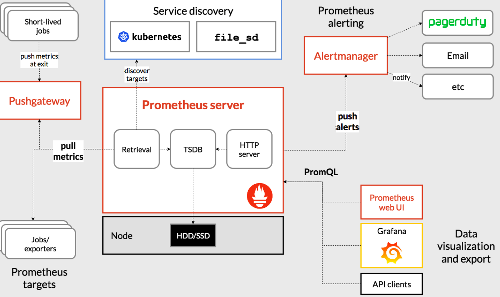

# Prometheus

## 原理

Prometheus的核心是使用 Pull的方式去搜集被监控对象的 Metrics 数据（监控指标数据），然后，再把这些数据保存在一个 TSDB （时间序列数据库，比如 OpenTSDB、InfluxDB 等）当中，以便后续可以按照时间进行检索。有了这套核心监控机制， Prometheus 剩下的组件就是用来配合这套机制的运行：

- Pushgateway可以允许被监控对象以 Push 的方式向 Prometheus 推送 Metrics 数据。
- Alertmanager可以根据 Metrics 信息灵活地设置报警。
- Grafana 对外暴露出的、可以灵活配置的监控数据可视化界面。

### Metrics

Prometheus的Exporter是代替被监控对象来对 Prometheus 暴露出可以被“抓取”的 Metrics 信息的一个辅助进程。

- 第一种 Metrics是宿主机的监控数据，由 Prometheus 维护的Node Exporter 提供。Node Exporter 会以 DaemonSet 的方式运行在宿主机上。而 Node Exporter 可以暴露给 Prometheus 采集的 Metrics 数据， 也不单单是节点的负载（Load）、CPU 、内存、磁盘以及网络这样的常规信息，它的 Metrics 指标可以说是“包罗万象”
- 第二种 Metrics是来自于k8s的 API Server、kubelet 等组件的 /metrics API。除了常规的 CPU、内存的信息外，这部分信息还主要包括了各个组件的核心监控指标。比如，对于 API Server 来说，它就会在 /metrics API 里，暴露出各个 Controller 的工作队列（Work Queue）的长度、请求的 QPS 和延迟数据等等。这些信息，是检查 Kubernetes 本身工作情况的主要依据。
- 第三种 Metrics是k8s的核心概念监控数据（core metrics），包括 Pod、Node、容器、Service 等主要k8s核心概念的 Metrics。其中，容器相关的 Metrics 主要来自于 kubelet 内置的 cAdvisor 服务，它能够提供的信息，可以细化到每一个容器的 CPU 、文件系统、内存、网络等资源的使用情况。这些cAdvisor的数据由k8s Metrics Server（代替先前的Heapster）汇总，并且把这些信息通过标准的 Kubernetes API 暴露了出来。Metrics Server 并不是 kube-apiserver 的一部分，而是通过 Aggregator 插件机制独立部署的同 kube-apiserver 一起统一对外服务的。

## Custom Metrics

当把Custom Metrics APIServer 启动之后，Kubernetes 里就会出现一个叫作custom.metrics.k8s.io的 API。而当你访问这个 URL 时，Aggregator 就会把你的请求转发给 Custom Metrics APIServer 。

Custom Metrics APIServer 的实现，其实就是一个 Prometheus 项目的 Adaptor，用来查询Prometheus里的相关指标。
