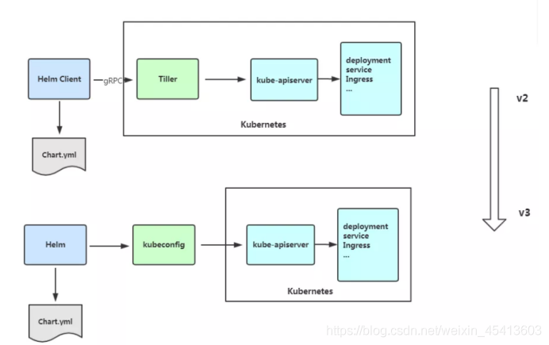

# Helm
## Introduction

helm 是 k8s 的一个项目，相当于 Linux 的 yum。在 yum 仓库中，yum 不光要解决包之间的依赖关系，还要提供具体的程序包。helm 仓库里面只有配置清单文件而没有镜像，镜像还是由镜像仓库来提供，如 hub.docker.com、私有仓库。helm 提供了一个应用所需要的所有清单文件。例如一个 nginx，需要一个 deployment 清单文件、一个 service 清单文件、一个 hpa 的清单文件，把这 3 个文件打包到一起就是一个应用的程序包，称之为 Chart。Chart 是一个 helm 程序包，其实质只是一个模板，可以对这个模板进行赋值（value），形成自定义的清单文件。Helm 把 K8s 资源打包到一个 chart 中，而 chart 被保存到 chart 仓库，通过 chart 仓库可用来存储和分享 chart。

### 原理

- chart：是 Helm 管理的安装包，里面包含需要部署的安装包资源。
- config：包含了可以合并到打包的 chart 中的配置信息，用于创建一个可发布的对象。
- release：是一个与特定 config 相结合的 chart 的运行实例，一个 chart 可以部署多个 release，即这个 chart 可以被安装多次。
- repository：chart 的仓库，用于发布和存储 chart。

### chart 包
每个chart包含下面两部分：
- Chart.yaml：描述本chart的基本信息，如名称版本等 
- values.yaml：chart配置的默认值
- templates：存放k8s manifest文件模板的目录，模板使用chart配置的值生成k8s manifest（yaml）文件
- charts：本chart需要依赖的其他chart

### Helm2 架构
- 客户端bin：通过gRPC连接到服务器端Tiller
- 服务器端Tiller：用来调用k8s api-server

### Helm3 架构

**Helm Client** ：

- 本地 chart 开发
- 管理仓库
- 管理 release
- 与 Helm 库建立接口
  - 发送安装的chart
  - 发送升级或卸载现有发布的请求

**Helm Library**：提供执行所有 Helm 操作的逻辑。独立的Helm库封装了Helm逻辑以便不同的客户端可以使用它。与K8s Apiserver 交互并提供以下功能：

- 结合 chart 和 config 来构建 release
- 将 chart 安装到 K8s 中
- 与 K8s 交互升级和卸载 chart

Helm3 最明显的变化是删除了 Tiller



### Installation

#### Helm2
版本: v2.9.1
- `cd /data`
- `wget http://openstack.oa.com/tshift/helm-v2.9.1-linux-amd64.tar.gz`: download Helm client
- `docker pull docker-registry.tshift-test.oa.com/tiller:v2.9.1`: download Helm Tiller
- `yum install -y socat`
- `tar -zxvf helm-v2.9.1-linux-amd64.tar.gz`
- `mv linux-amd64/helm /usr/local/bin/helm`: install Helm client
- `helm init --tiller-image tiller:v2.9.1 --skip-refresh`

#### Helm3 Docker-for-Desktop

```shell
curl -s https://get.helm.sh/helm-v3.1.0-darwin-amd64.tar.gz | tar xzv
sudo cp darwin-amd64/helm /usr/local/bin
rm -rf darwin-amd64
```

### Init Repo

```shell
helm version
helm repo add stable https://mirror.azure.cn/kubernetes/charts/
helm repo add incubator https://mirror.azure.cn/kubernetes/charts-incubator/
helm repo update
helm search repo stable
helm install my-redis stable/redis
helm uninstall my-redis
```

## Existing Charts

### MySQL

```shell
helm install my-mysql stable/mysql
helm uninstall my-mysql
```

- 获取密码

```shell
MYSQL_ROOT_PASSWORD=$(kubectl get secret --namespace default my-mysql -o jsonpath="{.data.mysql-root-password}" | base64 --decode; echo)
echo $MYSQL_ROOT_PASSWORD
```

- 起一个 pod 作为客户端

```shell
kubectl run --rm -i --tty ubuntu --image=ubuntu:16.04 --restart=Never -- bash -il
- `apt-get update && apt-get install mysql-client -y`
-	`mysql -h my-mysql -p`
```

- 本地客户端接入: Docker-for-Desktop 可用

```shell
MYSQL_HOST=127.0.0.1
MYSQL_PORT=3306
kubectl port-forward --namespace default svc/my-mysql 3307:3306 & 
mysql -h 127.0.0.1 -P3307 -u root -p${MYSQL_ROOT_PASSWORD} # port 3306 already in use
```

- mysql 验证

```sql
show databases;
```

### MongoDB

```shell
helm install my-mongodb stable/mongodb
helm uninstall my-mongodb
```

- 获取密码

```shell
export MONGODB_ROOT_PASSWORD=$(kubectl get secret --namespace default my-mongodb -o jsonpath="{.data.mongodb-root-password}" | base64 --decode)
```

- 起一个 pod 作为客户端

```shell
kubectl run --namespace default my-mongodb-client --rm --tty -i --restart='Never' --image docker.io/bitnami/mongodb:4.2.4-debian-10-r0 --command -- mongo admin --host my-mongodb --authenticationDatabase admin -u root -p $MONGODB_ROOT_PASSWORD
```

- 本地客户端接入: Docker-for-Desktop 可用

```shell
kubectl port-forward --namespace default svc/my-mongodb 27017:27017 & mongo --host 127.0.0.1 --authenticationDatabase admin -p $MONGODB_ROOT_PASSWORD
```

- mongodb 验证

```shell
show dbs
use runoob # 创建db
db # 显示当前db
db.runoob.insert({"name":"菜鸟教程"}) # 插入一条数据
db.dropDatabase() # 删除db
```

### Redis

```shell
helm install my-redis stable/redis
helm uninstall my-redis
```

- 获取密码

```shell
export REDIS_PASSWORD=$(kubectl get secret --namespace default my-redis -o jsonpath="{.data.redis-password}" | base64 --decode) 
```

- 起一个 pod 作为客户端

```shell
kubectl run --namespace default my-redis-client --rm --tty -i --restart='Never' --env REDIS_PASSWORD=$REDIS_PASSWORD --image docker.io/bitnami/redis:5.0.7-debian-10-r32 -- bash
-	`redis-cli -h my-redis-master -a $REDIS_PASSWORD` # read/write operation
-	`redis-cli -h my-redis-slave -a $REDIS_PASSWORD` # read-only operation
```

- 本地客户端接入: Docker-for-Desktop 可用

```shell
kubectl port-forward --namespace default svc/my-redis-master 6379:6379 & 
redis-cli -h 127.0.0.1 -p 6379 -a $REDIS_PASSWORD
```

- redis-cli 验证

```shell
set aaa "xxx"
get aaa
```

### Rabbitmq

```shell
helm install my-rabbitmq stable/rabbitmq
helm uninstall my-rabbitmq
```

- 获取密码

```shell
export RABBITMQ_USERNAME="user"
export RABBITMQ_PASSWORD=$(kubectl get secret --namespace default my-rabbitmq -o jsonpath="{.data.rabbitmq-password}" | base64 --decode)
export RABBITMQ_COOKIE=$(kubectl get secret --namespace default my-rabbitmq -o jsonpath="{.data.rabbitmq-erlang-cookie}" | base64 --decode)
```

- 本地客户端接入: Docker-for-Desktop 可用
  - AMQP

```shell
kubectl port-forward --namespace default svc/my-rabbitmq 5672:5672 &
echo "URL: amqp://127.0.0.1:5672/"
```

  - Management Interface

```shell
kubectl port-forward --namespace default svc/my-rabbitmq 15672:15672 &
echo "URL: http://127.0.0.1:15672/"
```

### Kafka(?)

```shell
helm install my-kafka stable/kafka-manager
helm uninstall my-kafka
```

- 本地客户端接入: Docker-for-Desktop 可用

```shell
export POD_NAME=$(kubectl get pods --namespace default -l "app=kafka-manager,release=my-kafka" -o jsonpath="{.items[0].metadata.name}")
kubectl port-forward $POD_NAME 8080:9000
```

### ElasticSearch(?)

```shell
helm install my-es stable/elasticsearch
helm uninstall my-es
```

- 本地客户端接入: Docker-for-Desktop 可用

```shell
export POD_NAME=$(kubectl get pods --namespace default -l "app=elasticsearch,component=client,release=my-es" -o jsonpath="{.items[0].metadata.name}")
kubectl port-forward --namespace default $POD_NAME 9200:9200 &
echo "URL: http://127.0.0.1:9200/"
```


## Custom Charts

### Release

- `helm create hello-svc`: create a Helm package
- `helm install --dry-run --debug ./`：验证模板和配置
- `helm install ./`：启动本chart的release
- `helm list`：list release
- `helm delete wishful-squid`

### Custom Charts

- `docker pull nginx:1.15`
- `helm create hello-helm`
- `helm install ./hello-helm`
- `export POD_NAME=$(kubectl get pods --namespace default -l "app=hello-helm,release=fallacious-snail" -o jsonpath="{.items[0].metadata.name}")`
- `kubectl port-forward $POD_NAME 8080:80`
- `echo "Visit http://127.0.0.1:8080 to use your application"`

## Reference

- [是时候使用Helm了：Helm, Kubernetes的包管理工具](https://www.kubernetes.org.cn/3435.html)
- [简化Kubernetes应用部署工具-Helm简介](https://blog.csdn.net/M2l0ZgSsVc7r69eFdTj/article/details/78164002)