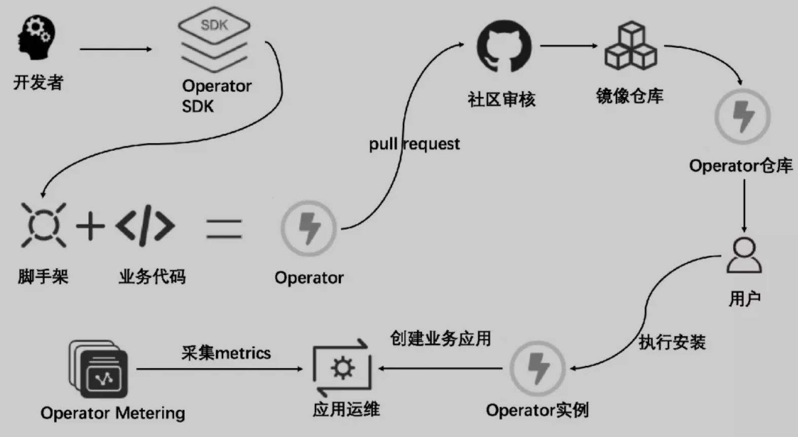

# Operator

## 简介

Operator 框架 = 自定义 CRD + 自定义 Controller

### 历史

CoreOS 在 2016 年底提出了 Operator 的概念，当时的一段官方定义如下：“An Operator represents human operational knowledge in software, to reliably manage an application.”

谷歌率先提出了 TPR（Third Party Resource）的概念，允许开发者根据业务需求以插件化形式扩展出相应的 K8s API 对象模型，同时提出了自定义 controller 的概念用于编写面向领域知识的业务控制逻辑，基于 Third Party Resource，K8s 社区在 1.7 版本中提出了[custom resources and controllers](https://mp.weixin.qq.com/s?__biz=MzUzNzYxNjAzMg==&mid=2247493984&idx=1&sn=59238e3a71d14702191e5c518b749836&chksm=fae6e2afcd916bb92a15170911643357ac56fa72ae9bf844b500fbd5e5253fd741f5af0d797c&token=10947129&lang=zh_CN&scene=21#wechat_redirect) 的概念，这正是 Operator 的核心概念。

CoreOS 是最早的一批基于 K8s 提供企业级容器服务解决方案的厂商之一，他们很敏锐地捕捉到了 TPR  和控制器模式对企业级应用开发者的重要价值。并很快由邓洪超等人基于 TPR 实现了历史上第一个 Operator：etcd-operator。它可以让用户通过短短的几条命令就快速的部署一个 etcd 集群，并且基于 kubectl  命令行一个普通的开发者就可以实现 etcd 集群滚动更新、灾备、备份恢复等复杂的运维操作，极大的降低了 etcd 集群的使用门槛，在很短的时间就成为当时 K8s 社区关注的焦点项目。

而 Operator 的出现打破了社区传统意义上的格局，对于谷歌团队而言，Controller 作为 Kubernetes 原生 API  的核心机制，应该交由系统内部的 Controller Manager 组件进行管理，并且遵从统一的设计开发模式，而不是像 Operator 那样交由应用开发者自由地进行 Controller 代码的编写。另外 Operator 作为 K8s 生态系统中与终端用户建立连接的桥梁，作为 K8s 项目的设计和捐赠者，谷歌当然也不希望错失其中的主导权。同时 Brendan Burns 突然宣布加盟微软的消息，也进一步加剧了谷歌团队与 Operator 项目之间的矛盾。于是，2017 年开始谷歌和 RedHat 开始在社区推广 Aggregated Apiserver，应用开发者需要按标准的社区规范编写一个自定义的  Apiserver，同时定义自身应用的 API 模型。通过原生 Apiserver 的配置修改，扩展 Apiserver 会随着原生组件一同部署，并且限制自定义 API 在系统管理组件下进行统一管理。之后，谷歌和 RedHat 开始在社区大力推广使用聚合层扩展  K8s API，同时建议废弃 TPR 相关功能。

然而，巨大的压力并没有让 Operator 昙花一现，就此消失。相反，社区大量的 Operator 开发和使用者仍旧拥护着 Operator 清晰自由的设计理念，继续维护演进着自己的应用项目。同时很多云服务提供商也并没有放弃 Operator，Operator  简洁的部署方式和易复制，自由开放的代码实现方式使其维护住了大量忠实粉丝。在用户的选择面前，强如谷歌、红帽这样的巨头也不得不做出退让。最终，TPR 并没有被彻底废弃，而是由 CRD（Custom Resource Definition）资源模型范式代替。2018 年初，RedHat 完成了对 CoreOS 的收购，并在几个月后发布了 Operator Framework，通过提供 SDK 等管理工具的方式进一步降低了应用开发与 K8s 底层 API 知识体系之间的依赖。至此，Operator 进一步巩固了其在 K8s 应用开发领域的重要地位。【1】

### 生命周期

- 开发者使用 Operator SDK 创建一个 Operator 项目；
- SDK 生成 Operator 对应的脚手架代码，然后扩展相应业务模型和 API，实现业务逻辑完成 Operator 的代码编写；
- 参考社区[测试指南](https://mp.weixin.qq.com/s?__biz=MzUzNzYxNjAzMg==&mid=2247493984&idx=1&sn=59238e3a71d14702191e5c518b749836&chksm=fae6e2afcd916bb92a15170911643357ac56fa72ae9bf844b500fbd5e5253fd741f5af0d797c&token=10947129&lang=zh_CN&scene=21#wechat_redirect)进行业务逻辑的本地测试以及打包和发布格式的本地校验；
- 在完成测试后可以根据[规定格式](https://mp.weixin.qq.com/s?__biz=MzUzNzYxNjAzMg==&mid=2247493984&idx=1&sn=59238e3a71d14702191e5c518b749836&chksm=fae6e2afcd916bb92a15170911643357ac56fa72ae9bf844b500fbd5e5253fd741f5af0d797c&token=10947129&lang=zh_CN&scene=21#wechat_redirect)向社区提交[PR](https://mp.weixin.qq.com/s?__biz=MzUzNzYxNjAzMg==&mid=2247493984&idx=1&sn=59238e3a71d14702191e5c518b749836&chksm=fae6e2afcd916bb92a15170911643357ac56fa72ae9bf844b500fbd5e5253fd741f5af0d797c&token=10947129&lang=zh_CN&scene=21#wechat_redirect)，会有专人进行 review；
- 待社区审核通过完成 merge 后，终端用户就可以在 OperatorHub.io 页面上找到业务对应的 Operator 的说明文档和安装指南，通过简单的命令行操作即可在目标集群上完成 Operator 实例的安装；
- Operator 实例会根据配置创建所需的业务应用，OLM 和 Operator Metering 等组件可以帮助用户完成业务应用对应的运维和监控采集等管理操作。

## 原理

Operator 定义了一组在 K8s 集群中打包和部署复杂业务应用的方法，它可以方便地在不同集群中部署并在不同的客户间传播共享。同时 Operator 还提供了一套应用在运行时的监控管理方法，领域专家通过将业务关联的运维逻辑写入到 operator  自身控制器中，而一个运行中的 operator 就像一个 7*24 不间断工作的优秀运维团队，可以时刻监控应用自身状态和该应用在 K8s 集群中的关注事件，并在毫秒级别基于期望终态做出对监听事件的处理，比如对应用的自动化容灾响应或是滚动升级等高级运维操作。

### CRD

基于 custom resources 和相应的自定义资源控制器，可以自定义扩展 K8s 原生的资源，这样的自定义模型可以如同原生模型一样被 K8s API 管理，支持 kubectl 命令行。同时 Operator 开发者可以像使用原生 API 进行应用管理一样，通过声明式的方式定义一组业务应用的期望终态，并且根据业务应用的自身特点进行相应控制器逻辑编写，以此完成对应用运行时刻生命周期的管理并持续维护与期望终态的一致性。这样的设计范式使得应用部署者只需要专注于配置自身应用的期望状态，而无需再投入大量的精力在手工部署或是业务在运行时刻的繁琐运维操作中。

### Controller

在 K8s 实现容器编排的思想中，会使用控制器（Controller）模式对 etcd 里的 API 资源对象变化保持不断的监听（Watch），并在控制器中对指定事件进行响应处理，针对不同的 API 资源可以在对应的控制器中添加相应的业务逻辑，通过这种方式完成应用编排中各阶段的事件处理。

而 Operator 正是基于控制器模式，允许应用开发者通过扩展 K8s API 资源的方式，将复杂的分布式应用集群抽象为一个自定义的 API 资源，通过对自定义 API 资源的请求可以实现基本的运维操作，而在 Controller 中开发者可以专注实现应用在运行时管理中遇到的相关复杂逻辑。

## Ref

1. [云原生应用实现规范 - 初识 Operator](https://mp.weixin.qq.com/s/MveSspUcFFWSum1m_XtRlg)

