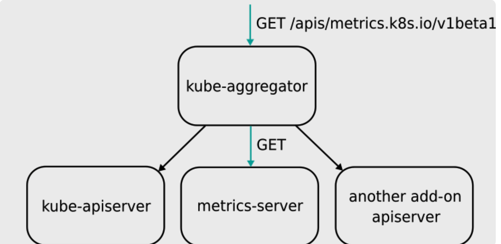

# kube-apiserver
## K8S Proxy API
kube-apiserver把收到的REST request转发到某个node的kubelet的REST端口上，通过k8s proxy API获得的数据来自node而非etcd。

- Authentication：

  - 最严格的HTTPS证书认证，基于CA根证书签名的双向数字证书 认证方式
  - HTTP Token认证：通过一个Token来识别合法用户 
  - Http Base认证：通过用户名+密码的方式认证
- Authorization：API Server授权，包括AlwayDeny、AlwaAllow、ABAC、RBAC、WebHook
- Admission Control：k8s AC体系中的最后一道关卡，官方标准的Adminssion Control就有10个，在启动kube-apiserver时指定

## Dynamic Admission Control（Initializer）

当任何一个API对象被提交给APIServer之后，总有一些“初始化”性质的工作需要在它们被k8s正式处理之前进行。比如，自动为所有Pod加上某些标签（Labels）。而这个“初始化”操作的实现，借助的是Admission Control功能。它其实是k8s里一组被称为Admission Controller的代码，可以选择性地被编译进APIServer中，在API对象创建之后会被立刻调用到。k8s提供了一种“热插拔”式的Admission机制，它就是Dynamic Admission Control，也叫作：Initializer。

 Initializer也是一个controller，实时查看用户给APIServer的请求，遇到实际状态与期望值不同时，更新用户API对象。更新用户的API对象的时候，使用PATCH API来完成merge工作。而这种PATCH API，正是声明式API最主要的能力。Initializer会再创建一个新的对象，然后通过TwoWayMergePatch和PATCH API把两个API对象merge，完成类似注入的操作。

## Aggregated API

APIServer Aggregator的设计思路是允许用户编写一个自定义的APIServer，在这里面添加自定义API。这个APIServer就可以跟k8s原生的APIServer绑定部署在一起统一提供服务了。同时，构建出的API接口更加规范整齐，能利用k8s原生的认证、授权、准入机制。

不同于CRD，Aggregated APIServer中的API资源是通过代码向k8s注册资源类型的方式实现的，而CRD是直接通过yaml文件创建自定义资源的方式实现的。

## URL
- `kubectl proxy --port=8080`: create a local proxy for the local `kubelet` `API server`
- `curl 127.0.0.1:8080/api`
- `curl 127.0.0.1:8080/api/v1`
- `curl 127.0.0.1:8080/api/v1/pods`

