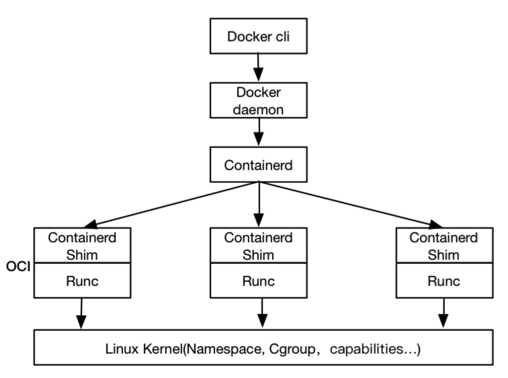

# Docker

Docker是一个来管理容器运行时的工具，其想法是隔离运行应用程序的单个进程，并监督容器的生命周期及其使用的资源。不同于其他的容器技术，Docker创新性地解决了应用打包和分发技术难题，并且通过友好的设计和封装，大大降低了容器技术的使用门槛。

## 容器运行时

### libcontainer

在Docker最初使用LXC来创建其容器。后来Docker开发了其自己的libcontainer库与Linux内核功能（如namespace和cgroup）进行交互，用于创建和管理隔离的容器环境。

### runC

随着Docker内部架构的日渐复杂，它把底层容器管理部分单独剥离出来作为一个底层容器运行时，称作runC。runC中包含了原先的libcontainer库，可以独立于Docker引擎，其目标是使标准容器随处可用。runC专注于容器器实现，包括环境隔离、资源限制、容器器安全等，后被捐赠给了OCI。

### containerd

在将runC项目提供给OCI的同时，Docker在2016年开始使用Containerd作为其上层容器运行时。为了使容器生态系统保持标准化，低层的runC容器运行时只允许运行容器，它更轻巧、快速，并且不会与其他更高层级的容器管理发生冲突。而像Containerd这类上层容器运行时负责容器生命周期管理，如镜像传输和存储、容器运行和监控、底层存储、网络附件。

Containerd向上为Docker守护进程提供了gRPC接口、屏蔽底层细节，向下通过containerd-shim操控runC，使得上层Docker守护进程和底层容器运行时相互独立。

### 整体流程

- Docker引擎创建容器（来自镜像）并将其传递给Containerd
- Containerd调用containerd-shim，containerd-shim用于处理exit code、wait4()、tty/stdio reparenting等问题，实现daemonless容器。
- containerd-shim使用runC来运行容器：即使Docker和/或容器死亡，containerd-shim也会保证stdin、stdout和stderr这些文件描述符为打开状态。
- Containerd-shim可以让运行时（此处为runC）在启动容器后退出

## 镜像

应用打包、部署的最大问题是必须为每种语言、每种框架，甚至每个版本的应用维护一个打好的包。这个打包过程没有任何章法可循，在一个环境中运行得很好的应用，却需要做很多修改和配置工作才能在另一个环境里运行起来。而Docker 镜像解决的正是打包这个根本性问题。 所谓Docker镜像，其实就是一个压缩包，这个压缩包直接由一个完整操作系统的所有文件和目录构成的，也就是包含了这个应用运行所需要的所有依赖，所以这个压缩包里的内容跟本地开发和测试环境用的操作系统是完全一致的。Docker镜像标准化了应用执行的环境，包含了完整的运行环境，保证了环境的一致性。

通过Docker，我们可以先用这个镜像在本地进行开发和测试，之后上传到云端运行。在这个过程中，不需要进行任何配置或者修改，因为Docker镜像提供了本地环境和云端环境的高度一致。所以，虽然我们往往把Docker容器归并为PaaS，但其实Docker并不是PaaS，而是为PaaS提供自动化部署工具。

