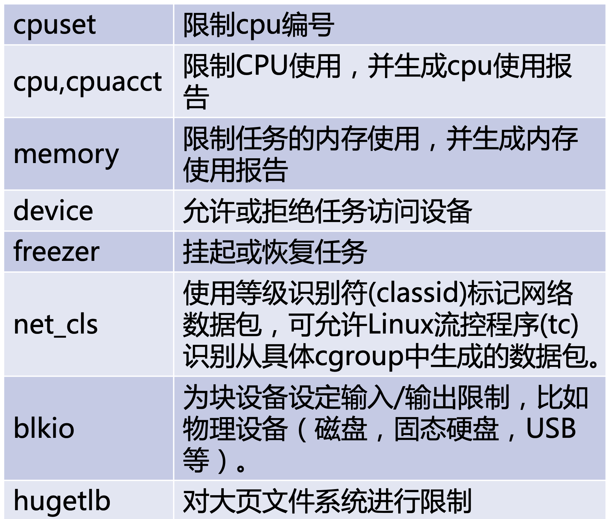

# cgroup

## Introduction




## Exercises

- 列出所有cgroup的subsystem

```bash
$ lssubsys –m
cpuset /sys/fs/cgroup/cpuset cpu,cpuacct /sys/fs/cgroup/cpu,cpuacct memory /sys/fs/cgroup/memory devices /sys/fs/cgroup/devices
freezer /sys/fs/cgroup/freezer
net_cls /sys/fs/cgroup/net_cls
blkio /sys/fs/cgroup/blkio
hugetlb /sys/fs/cgroup/hugetlb	
```

- 限制CPU

```bash
$ ls /sys/fs/cgroup/cpu/mytest
ls: cannot access /sys/fs/cgroup/cpu/mytest: No such file or directory

$ cgcreate -g cpu:mytest
$ ls /sys/fs/cgroup/cpu/mytest cpu.cfs_quota_us cpu.cfs_period_us tasks
$ while :; do :; done &
[2] 1759

$ top -p 1759
PID USER PR NI VIRT RES SHR S %CPU %MEM TIME+ COMMAND 1759 root 20 0 10956 1064 376 R 100.0 0.0 0:28.85 bash

$ cat /sys/fs/cgroup/cpu/mytest/cpu.cfs_period_us
100000

$ cat /sys/fs/cgroup/cpu/mytest/cpu.cfs_quota_us
-1

$ cat /sys/fs/cgroup/cpu/mytest/tasks
$ echo 30000 > /sys/fs/cgroup/cpu/mytest/cpu.cfs_quota_us 
$ cgclassify -g cpu:mytest 1759
$ cat /sys/fs/cgroup/cpu/mytest/cpu.cfs_quota_us
30000

$ cat /sys/fs/cgroup/cpu/mytest/tasks
1759

$ top –p 1759
PID USER PR NI VIRT RES SHR S %CPU %MEM TIME+ COMMAND 1759 root 20 0 10956 1064 376 R 30.0 0.0 5:40.76 bash
```

- 限制磁盘I/O

```bash
$ dd if=/dev/sda1 of=/dev/null
# iptop查看
TID PRIO USER DISK READ DISK WRITE SWAPIN IO> COMMAND
8128 be/4 root 55.74 M/s 0.00 B/s 0.00 % 85.65 % dd if=/de~=/dev/null...
$ mkdir /sys/fs/cgroup/blkio/mytest
$ echo '8:0 1048576' > /sys/fs/cgroup/blkio/mytest/blkio.throttle.read_bps_device 
$ echo 8128 > /sys/fs/cgroup/blkio/mytest/tasks
TID PRIO USER DISK READ DISK WRITE SWAPIN IO> COMMAND
8128 be/4 root 973.20 K/s 0.00 B/s 0.00 % 94.41 % dd if=/de~=/dev/null...
```


