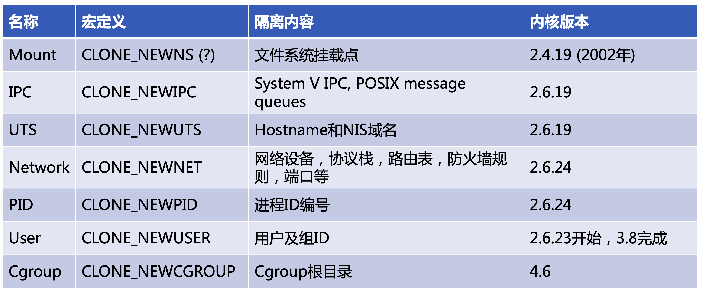

# Namespace 

## Introduction



## Exercises

- 列出默认namespace

```bash
$ ls -l /proc/1/ns
lrwxrwxrwx 1 root root 0 May 31 17:30 cgroup -> cgroup:[4026531835]
lrwxrwxrwx 1 root root 0 May 31 17:30 ipc -> ipc:[4026531839]
lrwxrwxrwx 1 root root 0 May 7 2018 mnt -> mnt:[4026531840]
lrwxrwxrwx 1 root root 0 May 7 2018 net -> net:[4026531957]
lrwxrwxrwx 1 root root 0 May 31 17:30 pid -> pid:[4026531836]
lrwxrwxrwx 1 root root 0 Dec 25 10:50 uts -> uts:[4026531838]
```

- 列出某个容器的namespace

```bash
$ docker inspect --format '{{.State.Pid}}' a2f4638e0894
26380
$ ls -alt /proc/26380/ns
lrwxrwxrwx 1 root root 0 May 31 19:23 cgroup -> cgroup:[4026531835] lrwxrwxrwx 1 root root 0 May 31 17:37 ipc -> ipc:[4026532242] 
lrwxrwxrwx 1 root root 0 May 31 17:37 pid -> pid:[4026532245] 
lrwxrwxrwx 1 root root 0 May 31 17:37 uts -> uts:[4026532241] 
lrwxrwxrwx 1 root root 0 May 31 17:37 net -> net:[4026532248] 
lrwxrwxrwx 1 root root 0 May 31 17:37 mnt -> mnt:[4026532240]
```

