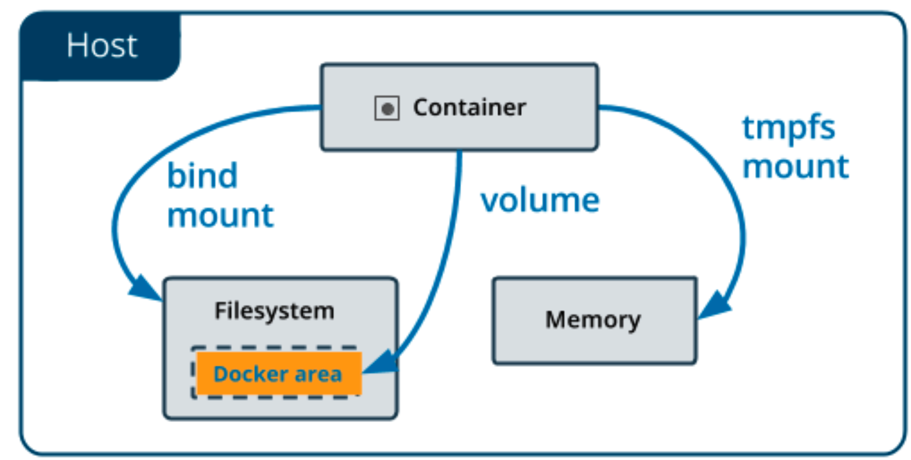

# Volume
## Introduction

Docker中的volume机制允许你将宿主机上指定的目录或者文件，挂载到容器里面进行读取和修改操作。

### 挂载流程

- 创建容器进程：
- 创建新的mount namespace：当容器进程被创建后，尽管开启了Mount namespace，但是在它执行chroot（或pivot_root）之前，容器进程一直可以看到宿主机上的整个文件系统。Mount namespace的作用只是隔离挂载点，是容器进程只能能到它自己的挂载点。
- 使用容器镜像在新的mount namespace中设置该容器的rootfs：宿主机上的文件系统也自然包括了容器的镜像，镜像的各个层保存在**/var/lib/docker/aufs/diff**目录下，而它的rootfs会被挂载在**/var/lib/docker/aufs/mnt/**目录中。
- 把Docker volume对应的主机上的目录bind mount到容器到rootfs的某个目录上：
  - 如果指定了宿主机的目录，则把指定的宿主机目录（比如/home目录）挂载到容器中指定的目录（比如/test目录）在宿主机对应的rootfs上的目录（即**/var/lib/docker/aufs/mnt/[可读写层 ID]/test**）上。由于执行这个挂载操作时Mount namespace已经开启，所以这个挂载事件只在这个容器里可见，在宿主机上是看不见这个挂载点的，这也就保证了容器的隔离性不会被volume打破。
  - 如果未指定目录，则会在宿主机``/var/lib/docker/volumes``下创建一个临时目录用于挂载。
- 调用chroot把rootfs设置为该容器/进程设置新的文件系统根目录：之后该容器只能看见该rootfs之下的目录及文件，从而实现容器在文件系统的隔离。

### 挂载类型



#### Volume Mount

使用``docker volume ...``创建的volume，指定存放在Docker的工作目录**/var/lib/docker/volumes**下。

如果在创建的容器时不指定volume，则会在该目录下创建一个临时volume。

- 在没有显示声明宿主机目录时，如``$ docker run -v /test ...``，Docker会默认在宿主机上创建一个临时目录/var/lib/docker/volumes/[VOLUME_ID]/_data，然后把它挂载到容器的指定的目录上。

#### Bind Mound

通过Linux的bind mount绑定挂载技术，允许将宿主机上一个目录或者文件而不是整个设备，挂载到容器的一个指定的目录上。这时在该挂载点上进行的任何操作，只是发生在被挂载的目录或者文件上，而原挂载点的内容则会被隐藏起来且不受影响。

- 指定目录：Docker把宿主机指定的目录挂载到容器指定的目录上，如``$ docker run -v /home:/test ...``。

此方法用于将宿主机上的任意目录或文件挂载到容器中与容器共享，但是这类挂载不可以通过``docker volume``管理。

### tmpfs Mount

第三种是在host的内存中通过tmpfs创建一个volume。因为数据存储在内存中，所以无法做持久化存储，同时也无法通过``docker volume``进行管理，只能作为临时数据的存储。


## Manipulation

### Basics

- `docker volume list`: list
- `docker volume inspect VOL_ID`: inspect
- `docker volume create VOL_ID`: create

### Volume Mount

- `docker run -d -p 80:80 -v VOL_ID:/usr/local/apache2/htdocs httpd`
- `docker run -d -p 80:80 -v /usr/local/apache2/htdocs httpd`: a random volume will be created in `/var/lib/docker/volumes/XXX/_data`
- `echo "xxx" > /var/lib/docker/volumes/XXX/_data`

### Bind Mount
Mount host dir to container volume
- `docker container run -it --rm -v VOL_ID:path ubuntu:xenial`: attach a volume to a container
- `docker container run ... -v $(pwd):path...`: sync local dir to the container
- `docker container run ... -v $(pwd):path:rw ...`: setup *rw* permission for the volume
- `docker container run ... -v $(pwd):path:ro ...`: setup *ro* permission for the volume


## Exercises
- `docker volume create vol1`
- `docker container run -it --rm -v vol1:/data ubuntu:xenial /bin/bash`

in the container
```bash
ls /data # check the path in the container
touch /data/xxx
echo yyy > /data/xxx
```

in another terminal
```bash
docker container run -it --rm -v vol1:/data ubuntu:xenial /bin/bash`
cat /data/xxx # check the previously created `xxx` file and its content
```
