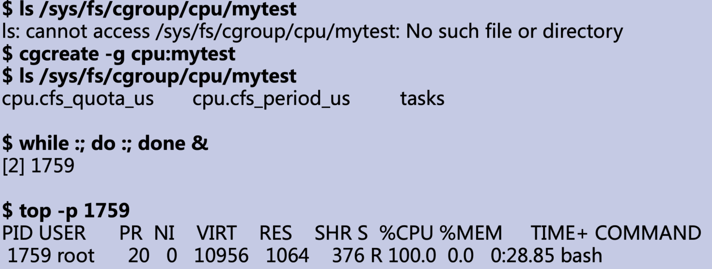
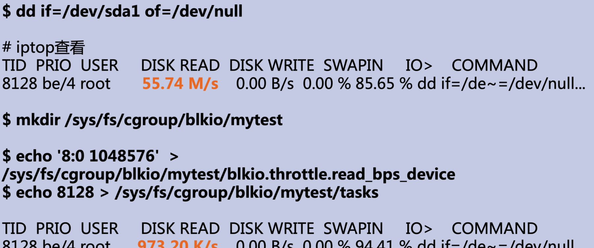

# Cgroup

cgroup是Linux内核中的一项功能，它可以对进程进行分组，并在分组的基础上对进程组进行资源分配（如 CPU时间、系统内存、网络带宽等）。通过cgroup，系统管理员在分配、排序、拒绝、管理和监控系统资源等方面，可以对硬件资源进行精细化控制。cgroup的目的和namespace不一样，namespace是为了隔离进程之间的资源，而cgroup是为了对一组进程进行统一的资源监控和限制。

cgroup技术就是把系统中所有进程组织成一颗进程树，进程树都包含系统的所有进程，树的每个节点是一个进程组。cgroup中的资源被称为subsystem，进程树可以和一个或者多个subsystem系统资源关联。系统中可以有很多颗进程树，每棵树都和不同的subsystem关联，一个进程可以属于多颗树，即一个进程可以属于多个进程组，只是这些进程组和不同的subsystem关联。进程树的作用是将进程分组，而subsystem的作用是监控、调度或限制每个进程组的资源。目前Linux支持12种subsystem，比如限制CPU的使用时间、内存、统计CPU的使用情况等。也就是Linux里面最多可以建12棵进程树，每棵树关联一个subsystem，当然也可以只建一棵树，然后让这棵树关联所有的subsystem。

在CentOS 7系统中通过将cgroup层级系统与systemd单位树捆绑，可以把资源管理设置从进程级别移至应用程序级别。默认情况下，systemd会自动创建slice、scope和service单位的层级，来为cgroup树提供统一结构。如果我们将系统的资源看成一块馅饼，那么所有资源默认会被划分为 3 个cgroup：System、User和Machine，每一个cgroup都是一个slice，每个slice都可以有自己的子slice。

## 操作

### CPU

### 磁盘IO

