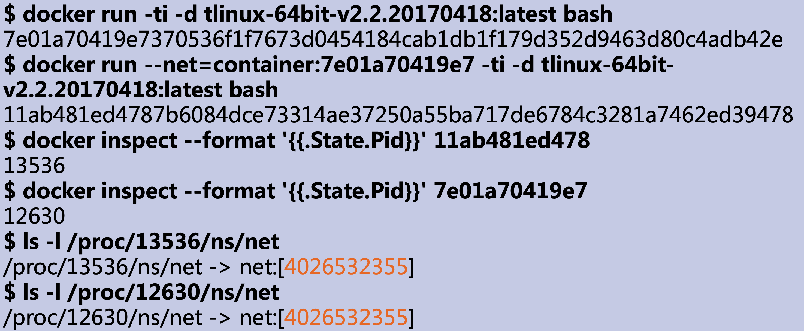
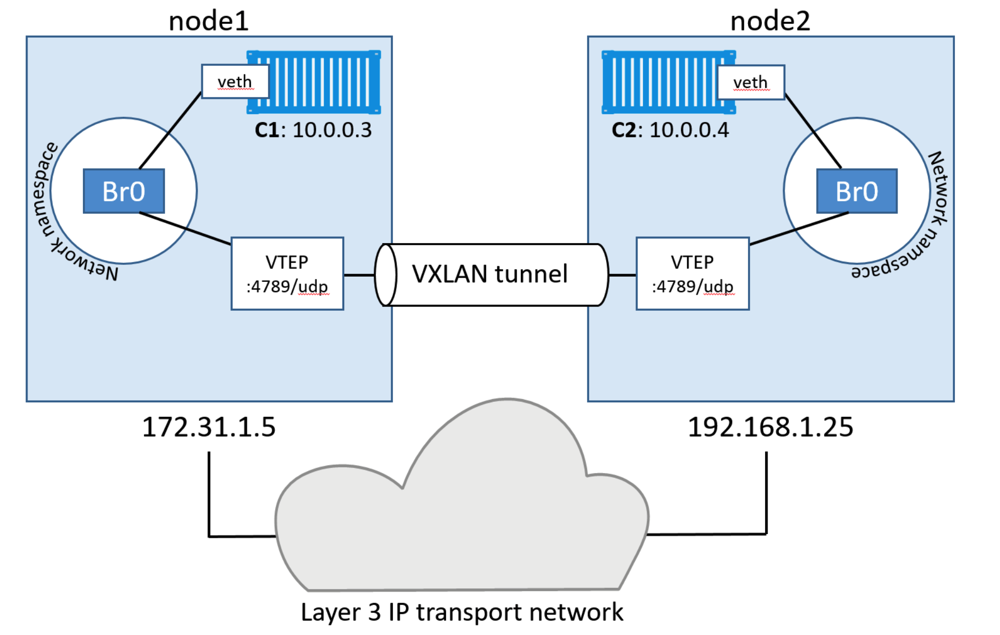

## 网络

Linux容器能看见的“网络栈”是被隔离在它自己的Network Namespace中的网卡（Network Interface）、回环设备（Loopback Device）、路由表（Routing Table）和 iptables 规则。对于一个进程来说，这些要素，其实就构成了它发起和响应网络请求的基本环境。

### none

**none**网络模式创建Network namepace，但不配置任何网络功能，容器启动后可以自行为容器配置网络。
操作：``docker run --net=none tlinux-64bit-v2.2.20170418:latest ip addr show``

### container

如果指定–net=container，**container**网络模式不创建Network Namepace，而是加入另一个运行中的容器的Network namespace。K8s中pod的网络就使用了该模式，pod中的容器都会加入pod-init容器创建的Network namespace中。

```
$ docker run -it --net container:4ddf4638572d busybox ifconfig
```

操作：



### host

如果指定–net=host，**host**网络模式不创建Network Namepace，而是共享主机的Network Namespace，它会和宿主机上的其他普通进程一样，直接共享宿主机的网络栈。

```bash
$ docker run –d –net=host --name nginx-host nginx
```


操作


### bridge

**bridge**网络模式是Docker默认的网络模式，它创建新Network Namepace、配置docker0 Linux bridge、创建veth pair，并且创建iptables NAT规则。同一宿主机上的容器之间通过docker0网桥互访，容器访问外网通过iptable NAT功能，容器可以通过宿主机端口映射对外暴露服务。


### overlay

Docker原生的跨主机通信模型，核心是Linux网桥与vxlan隧道，并且通过KV系统（consul、etcd）同步路由信息。

 


