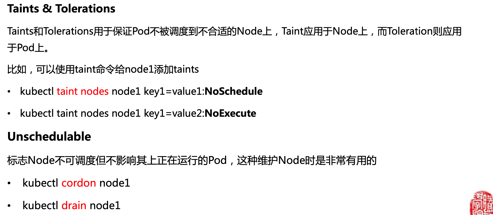

# Concept
## Cluster/ Master/ Node
### Terminology
- cluster: 1 or 3 master + n nodes
- master: a VM or a physical machine which coordinates the cluster
- node/worker: a VM or a physical machine which serves as a worker that runs applications
- namespace: virtual cluster for resource isolation

### Port
- pod port
  - containerPort: Docker image/container's exposed port
- service port
  - targetPort: *pod's containerPort*
  - port: service's port, clusterIP's port. If not specified, use the same as targetPort 
  - nodePort: node's exposed port for the service

## Node

Node可以是物理机也可以是VM，每个node上至少运行kubelet和container runtime。默认情况下，kubelet在启动时会自动想k8s master注册自己。Node包括以下信息：

- 地址：hostname、外网地址、内网地址
- Condition：OutOfDisk、Ready、MemoryPressure、DiskPressure
- Capacity：node上可用的资源，包括CPU、内存、Pod总数
- Info基本信息：内核版本、容器引擎版本、OS类型等
- Allocable可分配资源：node上可用的资源，包括CPU、内存、Pod总数

### Taint & Toleration

Taint和Toleration用于保证pod不被调度到不合适的node上，taint用于node上，而toleratin用于pod上。

### CMD

- `kubectl cluster-info`
- `kubectl get nodes`
  - `kubectl get nodes -o yaml`: -o output format
- `kubectl describe node NODE_ID`: detail about a node
- Cordon and Drain：设置某个节点为维护模式
  - `kubectl cordon NODE_ID`
  - `kubectl get nodes`
  - `kubectl drain NODE_ID --ignore-daemonsets`: 平滑迁移pod
  - `kubectl uncordon NODE_ID`: 取消节点的维护模式

## Namespace
Namespace是一组对资源和对象的抽象集合，可以用来将系统内部的对象划分为不同的组。常见的pod、deployment、service等都属于某个namespace，而node、pv等资源不属于任何namespace。

集群自身的核心服务一般运行在kube-system这个namespace中。刚创建集群时候存在一个default默认namespace，默认不需要输入namespace的名字。

### CMD
- list 
  - `kubectl get namespaces`
- select 
  - `kubectl --namespace=NS_ID get pods`: execute CMD within 1 namespace
  - `kubectl -n kube-system get pods`
- create
  - `kubectl create namespaces test`
  - `kubectl apply -f namespace.yaml` or `kubectl create -f namespace.yaml`
- delete
  - `kubeclt delete namespaces test`
  - `kubectl delete -f namespace.yaml`

## Monitor
- `kubectl top node`
- `kubectl -n kube-system top pod`

## Log
- `kubectl logs RESOURCE_ID`: logs
- `kubectl get event`